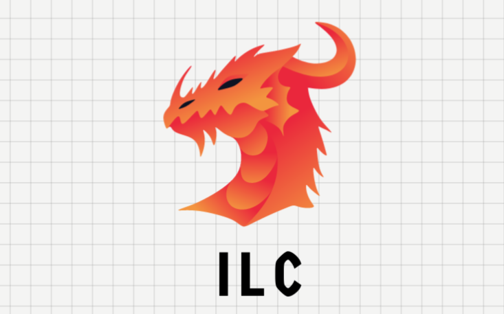

# ILC - I Love Compilers

ILC is a powerful, header-only C++20 framework designed for parsing, providing a set of libraries for tasks ranging from simple calculators to complex programming language syntax parsers. It leverages **context-free grammars** and employs a **up-bottom parsing** technique for efficient and effective parsing.

# Whats new on ILC 2.0?

## IMPROVED PERFOMANCE
  * ILC is faster now 

  ||1.0|2.0|
  |--|--|--|
  |Time|`0m21.430s`|`0m0.039s`|
  |Number of tokens|`1642`|`305280`|
  |Technique| bottom-up  | up-bottom |

## New Syntax 

### ILC 1.0
```cpp
int main(){
  context_free_grammar_t cfg;

  cfg.terminals = {PLUS, MINUS, TIMES, SLASH, EQU, DEQU, NOT, AND, OR, NUM, ID};

  cfg.non_terminals = {
        STAT,
        // operations
        SUM,
        SUB,
        MUL,
        DIV,
        ASGN,
        EQLT,
        NEG,
        CONJ,
        DISJ,
        VAL,
    };

  cfg.start = STAT;

    /* clang-format off */
  cfg.production_rule = {
        production{STAT, {ASGN}},
        production{STAT, {STAT, ASGN}},
        production{ASGN, {ID, EQU, VAL}},
        production{VAL, {VAL, PLUS, VAL}},
        production{VAL, {VAL, MINUS, VAL}},
        production{VAL, {VAL, TIMES, VAL}},
        production{VAL, {VAL, DIV, VAL}},
        production{VAL, {NUM}},
    };
    /* clang-format on */

  cfg.verify();

  shared_ptr<derivation_result_t> _result = make_shared<derivation_result_t>();

  vector<symbol_t> chain = {ID,    EQU,   NUM,   PLUS,  NUM};

  auto history = sentences_history_t{};

  auto is_valid = derivate_recursively(cfg, chain, history, _result);

  std::cout << (is_valid ? "is valid" : "is not valid") << std::endl;
}

```

### ILC 2.0

```cpp
enum SYMBOL { VAL, ID, NUM, PLUS, MINUS, MULT, DIV, EQU };

BEGIN_ILC_CODEGEN

BEGIN_PRODUCTION(PREFIX_VAL)
BEGIN_CHAIN_DECLARATION VAL END_CHAIN_DECLARATION 
  REQUIRE_NON_TERMINAL(0)
END_PRODUCTION

BEGIN_PRODUCTION(P000_VAL)
BEGIN_CHAIN_DECLARATION PLUS, VAL END_CHAIN_DECLARATION 
  REQUIRE_TERMINAL(0)
  REQUIRE_NON_TERMINAL(1)
END_PRODUCTION

BEGIN_PRODUCTION(P001_VAL)
BEGIN_CHAIN_DECLARATION MINUS, VAL END_CHAIN_DECLARATION 
  REQUIRE_TERMINAL(0)
  REQUIRE_NON_TERMINAL(1)
END_PRODUCTION

BEGIN_PRODUCTION(P002_VAL)
BEGIN_CHAIN_DECLARATION MULT, VAL END_CHAIN_DECLARATION 
  REQUIRE_TERMINAL(0)
  REQUIRE_NON_TERMINAL(1)
END_PRODUCTION

BEGIN_PRODUCTION(P003_VAL)
BEGIN_CHAIN_DECLARATION DIV, VAL END_CHAIN_DECLARATION 
  REQUIRE_TERMINAL(0)
  REQUIRE_NON_TERMINAL(1)
END_PRODUCTION

BEGIN_PRODUCTION(P004_VAL)
BEGIN_CHAIN_DECLARATION NUM END_CHAIN_DECLARATION 
  REQUIRE_TERMINAL(0)
END_PRODUCTION

BEGIN_PRODUCTION(P000_ASGN)
BEGIN_CHAIN_DECLARATION ID, EQU, VAL END_CHAIN_DECLARATION 
  REQUIRE_TERMINAL(0)
  REQUIRE_TERMINAL(1)
  REQUIRE_NON_TERMINAL(2)
END_PRODUCTION

BEGIN_BINDINGS
  BEGIN_SYMBOL_BINDING(VAL)
    (PREFIX_VAL() and ( P000_VAL() or P001_VAL() or P002_VAL() or P003_VAL() or true)) or 
    P004_VAL()
  END_SYMBOL_BINDING
END_BINDINGS

END_ILC_CODEGEN

using namespace ILC;

bool _parse() {
  offset = 0;
  while ((P000_ASGN()) && not(offset >= chain_size))
    ;
  std::cout << "stoped at: " << offset << std::endl;
  return offset == chain_size;
}

int main() {
  chain = { ID,EQU, NUM, PLUS, NUM, PLUS, NUM, PLUS, NUM};
  chain_size = chain.size();
  bool is_valid = _parse();
  std::cout << (is_valid ? "is valid" : "is not valid") << std::endl;
}

```


## Features

- **Simplicity**: ILC is designed to be straightforward and easy to use, making it accessible for both beginners and experienced developers.

- **Powerful Parsing**: The framework uses context-free grammars to successfully parse input, making it suitable for a variety of parsing tasks.

- **Header-Only**: ILC is a header-only library, making integration into your projects seamless without the need for additional build configurations.


##  ILC PILARS

This document outlines the key principles of the ILC PILARS framework.

1. __Conjugation__

   If multiple productions start with the same combination of tokens, they should be
     combined into a single non-terminal production called "conjugation of x,"
     where x is the common prefix shared among the productions.
     The format for this is as follows:
       ```
       conjugation_of_x := X and (P1_SUFFIX, P2_SUFFIX, ..., PN_SUFFIX)
       ```

2. __AOT Parsing__
  
   If precedence is required for a specific production, the system should first
     attempt to require a non-recursive candidate. If this attempt is successful,
     the normal require should be ignored, and a suffix solution should be invoked
     at the end of the production.


## Contributing

We welcome contributions! If you have ideas for improvements or find any issues, please open an [issue](https://github.com/your-username/ilc/issues) or submit a [pull request](https://github.com/your-username/ilc/pulls).

## License

This project is licensed under the MIT License - see the [LICENSE](LICENSE) file for details.


